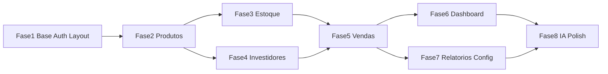

# Plano SHIR7 — 8 Fases (Prompts Oficiais)

> **Status:** aguardando execução fase a fase. Não implementar até o usuário solicitar explicitamente cada fase.
>
> Projeto greenfield: apenas [`README.md`](../../README.md) existe hoje.

## Mapa de fases (prompts do usuário)

| Fase | Escopo | Depende de |
|------|--------|------------|
| 1 | Base + Auth + Layout | — |
| 2 | Produtos | 1 |
| 3 | Estoque | 2 |
| 4 | Investidores | 2 (3 recomendado) |
| 5 | Vendas + Financeiro | 3 + 4 |
| 6 | Dashboard | 5 |
| 7 | Relatórios + Configurações | 5 (6 recomendado) |
| 8 | IA + Segurança + Polimento | 7 |



## Estrutura de pastas obrigatória

```
/index.html
/pages/          login, dashboard, inventory, sales, investors, reports
/src
  /assets/images, /assets/icons
  /css/base, /css/layout, /css/components, /css/pages, main.css
  /js/config/firebase.js
  /js/services   auth, product, stock, sales, investor, expense, report, ai
  /js/utils      calculations, formatCurrency, validators, domHelpers
  /js/pages      login, dashboard, inventory, sales, investors, reports
  /js/app.js
/firestore.rules, /storage.rules
```

## Schemas canônicos (nomenclatura dos prompts)

### `products`
`name`, `team`, `category`, `model`, `color`, `size`, `sku`, `imageUrl`, `supplier`, `stockOrigin` (`"proprio"` | `"investidor"`), `investorId`, `quantity`, `costPrice`, `suggestedSalePrice`, `minimumSalePrice`, `notes`, `status`, `createdAt`, `updatedAt`

### `stockMovements`
`productId`, `type` (`entrada`|`saida`|`ajuste`|`reserva`|`devolucao`), `quantity`, `previousQty`, `newQty`, `observation`, `userId`, `createdAt`, `relatedSaleId?`

### `investors`
`name`, `phone`, `email`, `repasseType`, `repasseValue`, `notes`, `createdAt`
- Tipos de repasse: percentual lucro, percentual faturamento, valor fixo/peça, custo + comissão, observação personalizada

### `sales`
Campos financeiros completos + `orderId`, `productId`, `quantity`, `unitPrice`, `unitCost`, `discount`, `fees`, `channel`, `paymentMethod`, `customer`, `stockOrigin`, `investorId`, `investorPayout`, `grossRevenue`, `totalRevenue`, `variableCosts`, `grossProfit`, `netProfit`, `margin`, `roi?`, `status`, `userId`, `createdAt`

### `settings` (doc `global`)
`defaultFees`, `minMarginPercent`, `lowStockThreshold`, `defaultRepasse`, `updatedAt`

### Coleções Firestore
`users`, `products`, `stockMovements`, `sales`, `investors`, `expenses`, `settings`, `reports`

---

## Fase 1 — Base + Auth + Layout

### Prompt de execução
> Execute APENAS a Fase 1. Não implemente produtos, estoque, vendas, investidores, relatórios nem IA.

### Objetivo
Entregar fundação completa + autenticação Firebase + layout responsivo navegável.

### Arquivos a criar/alterar

**Raiz e páginas**
- [`index.html`](../../index.html) — redireciona para `pages/login.html`
- [`pages/login.html`](../../pages/login.html) — formulário funcional
- [`pages/dashboard.html`](../../pages/dashboard.html), [`inventory.html`](../../pages/inventory.html), [`sales.html`](../../pages/sales.html), [`investors.html`](../../pages/investors.html), [`reports.html`](../../pages/reports.html) — layout base (sidebar, header, área de conteúdo vazia)

**CSS BEM**
- [`src/css/base/_reset.css`](../../src/css/base/_reset.css), [`_variables.css`](../../src/css/base/_variables.css), [`_typography.css`](../../src/css/base/_typography.css)
- [`src/css/layout/_header.css`](../../src/css/layout/_header.css), [`_sidebar.css`](../../src/css/layout/_sidebar.css), [`_grid.css`](../../src/css/layout/_grid.css)
- [`src/css/components/_button.css`](../../src/css/components/_button.css), [`_card.css`](../../src/css/components/_card.css), [`_form.css`](../../src/css/components/_form.css)
- [`src/css/pages/_login.css`](../../src/css/pages/_login.css) — demais `_*.css` de páginas: stub mínimo
- [`src/css/main.css`](../../src/css/main.css)

**JS**
- [`src/js/config/firebase.js`](../../src/js/config/firebase.js) — placeholders, init real (`initializeApp`, `getAuth`, `getFirestore`, `getStorage`)
- [`src/js/services/authService.js`](../../src/js/services/authService.js) — `login`, `logout`, `onAuthStateChanged`, `getCurrentUser`
- [`src/js/pages/login.js`](../../src/js/pages/login.js)
- [`src/js/app.js`](../../src/js/app.js) — proteção de rotas, navegação, logout, sidebar ativa
- [`src/js/utils/domHelpers.js`](../../src/js/utils/domHelpers.js) — `qs`, `qsa`, toast, modal helpers básicos

**Stubs vazios (estrutura completa)**
- Services: `product`, `stock`, `sales`, `investor`, `expense`, `report`, `ai`
- Utils: `calculations.js`, `formatCurrency.js`, `validators.js`
- Pages JS: `dashboard`, `inventory`, `sales`, `investors`, `reports`
- CSS components: `_modal.css`, `_table.css`, `_badge.css` (stub)

### Dependências
- Firebase Console: projeto criado, Auth Email/Senha ativado, credenciais preenchidas pelo usuário

### Critérios de conclusão
- [ ] Login Firebase funciona
- [ ] Páginas internas bloqueadas sem autenticação
- [ ] Layout responsivo (mobile + desktop)
- [ ] Sidebar com links: Dashboard, Estoque, Vendas, Investidores, Relatórios
- [ ] Estrutura completa de pastas/arquivos existe

### O que NÃO fazer
- CRUD de produtos, estoque, vendas, investidores, relatórios
- `calculations.js` com lógica real
- Upload de imagens, gráficos, IA, CSV
- `firestore.rules` definitivas (apenas stub se necessário)

### Entrega ao final da fase
Listar arquivos criados + o que falta para Fase 2 (produtos).

---

## Fase 2 — Produtos

### Prompt de execução
> Execute APENAS a Fase 2. Não altere o que já funciona na Fase 1.

### Objetivo
CRUD completo de produtos com upload de imagem, filtros e validações.

### Arquivos a criar/alterar
- [`src/js/services/productService.js`](../../src/js/services/productService.js) — CRUD Firestore + `uploadImage` Storage
- [`src/js/utils/validators.js`](../../src/js/utils/validators.js) — SKU duplicado, campos obrigatórios, investidor se `stockOrigin = investidor`
- [`pages/inventory.html`](../../pages/inventory.html), [`src/css/pages/_inventory.css`](../../src/css/pages/_inventory.css), [`src/js/pages/inventory.js`](../../src/js/pages/inventory.js)
- Refinar: [`_modal.css`](../../src/css/components/_modal.css), [`_table.css`](../../src/css/components/_table.css), [`_form.css`](../../src/css/components/_form.css), [`_badge.css`](../../src/css/components/_badge.css)
- [`storage.rules`](../../storage.rules) — upload autenticado em `products/{sku}/**`

### Funcionalidades
- Tabela com busca e filtros: time, tamanho, modelo, origem, investidor, status
- Modal criar / editar / visualizar produto
- Confirmação antes de excluir
- Mensagens de sucesso/erro (toast via domHelpers)

### Dependências
- Fase 1 concluída
- Firebase Storage ativado

### Critérios de conclusão
- [ ] CRUD completo com todos os campos do schema `products`
- [ ] Upload de imagem → `imageUrl` no Firestore
- [ ] Filtros funcionando
- [ ] Validações ativas (SKU duplicado, obrigatórios, investidor)

### O que NÃO fazer
- Movimentações de estoque (quantity editável no CRUD nesta fase)
- Investidores CRUD (select pode listar IDs ou campo texto até Fase 4)
- Vendas, dashboard com dados, relatórios

### Entrega ao final da fase
Listar arquivos alterados + pendências para Fase 3 (estoque).

---

## Fase 3 — Estoque

### Prompt de execução
> Execute APENAS a Fase 3. Não implementar vendas nem investidores ainda.

### Objetivo
Controle de movimentações com histórico, alertas e separação visual próprio vs investidor.

### Arquivos a criar/alterar
- [`src/js/services/stockService.js`](../../src/js/services/stockService.js)
- [`src/js/utils/calculations.js`](../../src/js/utils/calculations.js) — apenas `applyMovement` (saldo)
- Expandir [`inventory.html`](../../pages/inventory.html), [`_inventory.css`](../../src/css/pages/_inventory.css), [`inventory.js`](../../src/js/pages/inventory.js) — aba/seção Estoque

### Funcionalidades
- Movimentações: entrada, saída, ajuste, reserva, devolução
- Coleção `stockMovements` com produto, tipo, quantidade, data, usuário, observação
- Atualização automática de `quantity` no produto (batch/transação)
- Histórico de movimentações na tela
- Alerta estoque baixo — `settings.lowStockThreshold` ou **valor padrão** (ex.: 5) até Fase 7
- Filtros: modelo, tamanho, time, origem, investidor
- Separação visual: estoque próprio vs investidor

### Dependências
- Fases 1 e 2 concluídas

### Critérios de conclusão
- [ ] Toda movimentação reflete no estoque do produto
- [ ] Histórico registrado e filtrável
- [ ] Alertas de estoque baixo visíveis
- [ ] Estoque não fica negativo

### O que NÃO fazer
- Baixa automática via vendas
- CRUD investidores
- Dashboard, relatórios, settings UI

### Entrega ao final da fase
Listar arquivos alterados + pendências para Fase 4 (investidores).

---

## Fase 4 — Investidores

### Prompt de execução
> Execute APENAS a Fase 4. Não implementar vendas ainda.

### Objetivo
CRUD de investidores, regras de repasse e painel financeiro por investidor.

### Arquivos a criar/alterar
- [`src/js/services/investorService.js`](../../src/js/services/investorService.js)
- [`pages/investors.html`](../../pages/investors.html), [`src/css/pages/_investors.css`](../../src/css/pages/_investors.css), [`src/js/pages/investors.js`](../../src/js/pages/investors.js)
- Atualizar [`inventory.js`](../../src/js/pages/inventory.js) — select investidores do Firestore
- Expandir [`calculations.js`](../../src/js/utils/calculations.js) — totais investidor (sem venda ainda)

### Funcionalidades
- CRUD: name, phone, email, repasseType, repasseValue, notes
- Regras: percentual lucro, percentual faturamento, valor fixo/peça, custo + comissão, observação personalizada
- Painel por investidor: produtos vinculados, peças em estoque, valor investido, vendido (0 até Fase 5), lucro, repasse
- Vínculo com produtos (`stockOrigin = investidor`)

### Dependências
- Fases 1–3 concluídas (produtos com `investorId`)

### Critérios de conclusão
- [ ] CRUD investidores completo
- [ ] Produtos vinculados corretamente
- [ ] Totais calculados com base nos produtos em estoque

### O que NÃO fazer
- Registrar vendas ou repasse efetivo
- Dashboard analítico
- Relatórios, despesas, IA

### Entrega ao final da fase
Listar arquivos alterados + pendências para Fase 5 (vendas — fase crítica).

---

## Fase 5 — Vendas + Financeiro

### Prompt de execução
> Execute APENAS a Fase 5. Esta é a fase mais crítica.

### Objetivo
Fluxo completo de vendas com toda lógica financeira centralizada, baixa de estoque e repasse investidor.

### Arquivos a criar/alterar
- [`src/js/utils/calculations.js`](../../src/js/utils/calculations.js) — **TODA** lógica financeira
- [`src/js/utils/formatCurrency.js`](../../src/js/utils/formatCurrency.js) — `formatBRL` e helpers
- [`src/js/services/salesService.js`](../../src/js/services/salesService.js)
- [`pages/sales.html`](../../pages/sales.html), [`src/css/pages/_sales.css`](../../src/css/pages/_sales.css), [`src/js/pages/sales.js`](../../src/js/pages/sales.js)
- Expandir [`validators.js`](../../src/js/utils/validators.js) — regras de venda

### Cálculos obrigatórios (`calculations.js`)
- Faturamento bruto, faturamento total
- Custo produtos, custos variáveis
- Lucro bruto, lucro líquido
- Margem, ticket médio
- ROI (se houver tráfego pago)
- Repasse investidor (por `repasseType`)

### Validações
- Sem estoque, custo ausente, preço abaixo do mínimo, pedido duplicado, margem negativa

### Dependências
- Fases 1–4 concluídas

### Critérios de conclusão
- [ ] Venda registrada baixa estoque via `stockService`
- [ ] Cálculos corretos e exibidos na UI
- [ ] Repasse investidor calculado quando `stockOrigin = investidor`
- [ ] Todas as validações bloqueiam submit inválido

### O que NÃO fazer
- Dashboard com gráficos
- Relatórios e exportação CSV
- Settings UI (usar defaults hardcoded para margem mínima até Fase 7)
- Assistente IA

### Entrega ao final da fase
Listar arquivos alterados + pendências para Fase 6 (dashboard).

---

## Fase 6 — Dashboard

### Prompt de execução
> Execute APENAS a Fase 6.

### Objetivo
Painel analítico com cards, listas e gráficos em JS puro alimentados pelo Firestore.

### Arquivos a criar/alterar
- [`pages/dashboard.html`](../../pages/dashboard.html), [`src/css/pages/_dashboard.css`](../../src/css/pages/_dashboard.css), [`src/js/pages/dashboard.js`](../../src/js/pages/dashboard.js)

### Cards
Total produtos, valor estoque (custo), valor potencial venda, estoque próprio, estoque investidor, faturamento mês, lucro líquido mês, margem média, pedidos mês, ticket médio

### Listas
Estoque baixo, mais vendidos, maior lucro, vendas com prejuízo

### Gráficos (JS puro, sem lib pesada)
Faturamento/mês, lucro/mês, vendas por categoria, estoque por modelo, próprio vs investidor

### Dependências
- Fases 1–5 concluídas (dados de vendas e produtos)

### Critérios de conclusão
- [ ] Dashboard carrega dados reais do Firestore
- [ ] Gráficos renderizam corretamente (Canvas ou SVG)
- [ ] Responsivo

### O que NÃO fazer
- Relatórios filtrados e CSV (Fase 7)
- Tela de configurações persistente
- Assistente IA
- `firestore.rules` finais

### Entrega ao final da fase
Listar arquivos alterados + pendências para Fase 7 (relatórios + config).

---

## Fase 7 — Relatórios + Configurações

### Prompt de execução
> Execute APENAS a Fase 7.

### Objetivo
Relatórios filtráveis com exportação CSV, despesas e configurações globais aplicadas em vendas.

### Arquivos a criar/alterar
- [`src/js/services/reportService.js`](../../src/js/services/reportService.js)
- [`src/js/services/expenseService.js`](../../src/js/services/expenseService.js)
- [`pages/reports.html`](../../pages/reports.html), [`src/css/pages/_reports.css`](../../src/css/pages/_reports.css), [`src/js/pages/reports.js`](../../src/js/pages/reports.js)
- Tela/modal de **Configurações** (sidebar ou dashboard): taxas padrão, margem mínima, alerta estoque baixo, repasse padrão
- Atualizar [`sales.js`](../../src/js/pages/sales.js) — defaults de `settings`, editáveis por venda
- Atualizar [`inventory.js`](../../src/js/pages/inventory.js) + [`stockService.js`](../../src/js/services/stockService.js) — threshold de `settings`
- Coleção `reports` — snapshot ao gerar relatório

### Relatórios (com filtros)
Período, produto, modelo, tamanho, canal, pagamento, investidor, origem, status

Tipos: estoque, vendas, lucro, investidor, mais vendidos, parados, prejuízo, taxas/custos, repasse

### Dependências
- Fases 1–6 concluídas

### Critérios de conclusão
- [ ] Filtros funcionam em todos os relatórios
- [ ] CSV exporta corretamente (Blob + download)
- [ ] Settings aplicados como padrão em novas vendas (editáveis por venda)
- [ ] Alerta estoque baixo usa `settings.lowStockThreshold`

### O que NÃO fazer
- Assistente IA conversacional
- `firestore.rules` com roles
- Polish final de UX (Fase 8)

### Entrega ao final da fase
Listar arquivos alterados + pendências para Fase 8 (IA + segurança + polish).

---

## Fase 8 — IA + Segurança + Polimento

### Prompt de execução
> Execute APENAS a Fase 8.

### Objetivo
Assistente IA por regras internas, regras Firebase, polish UX e documentação final.

### Arquivos a criar/alterar
- [`src/js/services/aiService.js`](../../src/js/services/aiService.js)
- Widget assistente no dashboard ou área dedicada
- [`firestore.rules`](../../firestore.rules) — apenas autenticados; estrutura comentada para roles futuros (admin, financeiro, estoque)
- [`storage.rules`](../../storage.rules) — revisão final
- [`src/js/app.js`](../../src/js/app.js) — toasts globais, loading states
- Revisão responsiva final em layout + pages CSS
- [`README.md`](../../README.md) — setup Firebase completo

### Assistente IA (regras internas, sem API key)
Perguntas suportadas:
- Tamanhos para comprar
- Produtos parados
- Maior lucro / prejuízos
- Melhor investidor
- Custos que afetam margem
- Sugestão de compra / preço mínimo
- Alerta lucro baixo
- Análise próprio vs investidor

### Cloud Function
- `callCloudFunction(payload)` — stub preparado para integração futura

### Dependências
- Fases 1–7 concluídas

### Critérios de conclusão
- [ ] Assistente responde com base em dados reais do Firestore
- [ ] Nenhuma API key no frontend
- [ ] `firestore.rules` e `storage.rules` básicas criadas
- [ ] Confirmações, toasts, loading states em todo o sistema
- [ ] Sistema completo e navegável
- [ ] README com setup Firebase e checklist manual do usuário

### Configuração manual do usuário (checklist final)
- [ ] Criar projeto Firebase
- [ ] Ativar Auth (Email/Senha), Firestore, Storage
- [ ] Preencher credenciais em `src/js/config/firebase.js`
- [ ] Criar usuário admin no Console
- [ ] Publicar `firestore.rules` e `storage.rules`
- [ ] (Opcional) Deploy Cloud Function para IA externa

### O que NÃO fazer (pós-MVP)
- Integração real OpenAI/Claude
- Roles/permissões granulares ativas
- PWA, testes E2E, CI/CD

---

## Convenções transversais

- **BEM:** `block__element--modifier`
- **ES Modules:** `type="module"` em todos os scripts
- **Services:** retorno `{ success, data?, error? }`
- **Páginas protegidas:** importam `app.js` + seu `pages/*.js`
- **Ao final de cada fase:** listar arquivos criados/alterados + pendências da próxima fase

## Como executar

Enviar um prompt por vez, por exemplo:
> "Execute a Fase 1 do plano SHIR7"

Não pular fases. Não misturar escopos.
